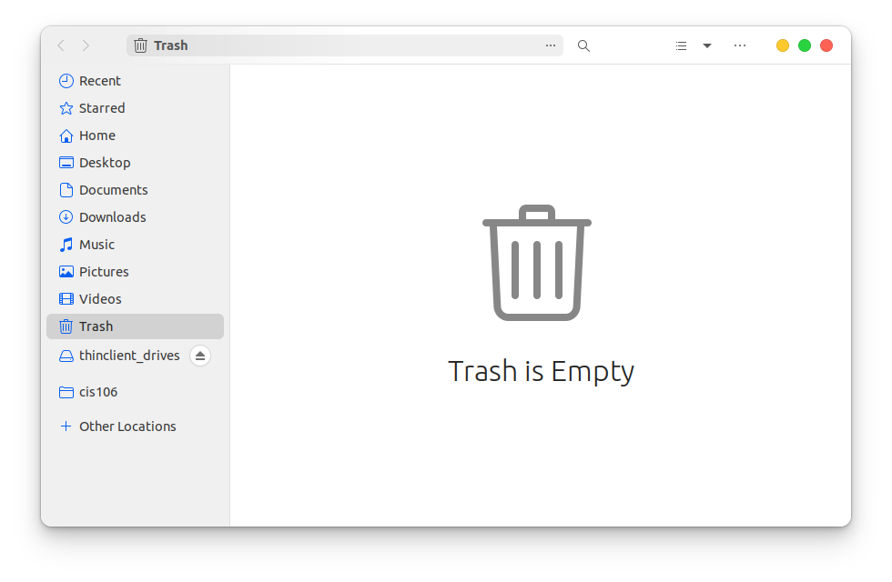
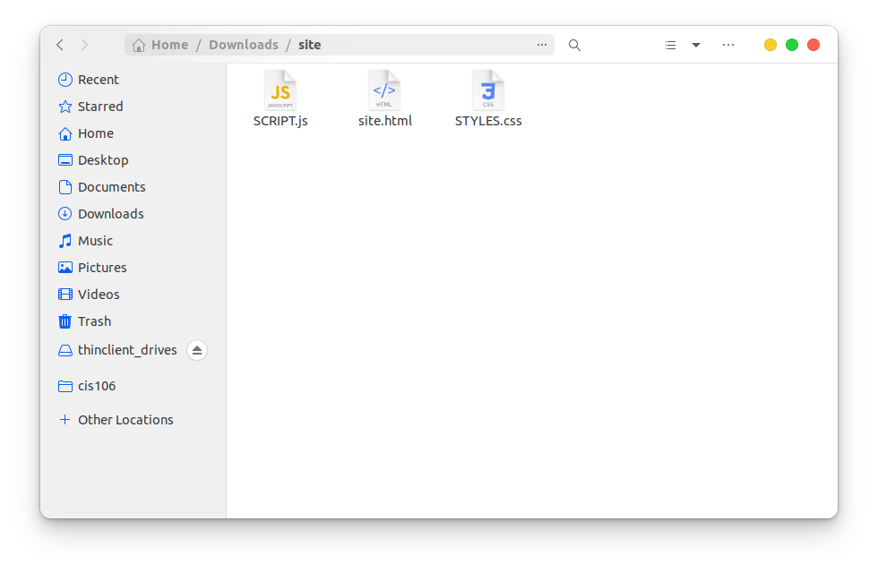
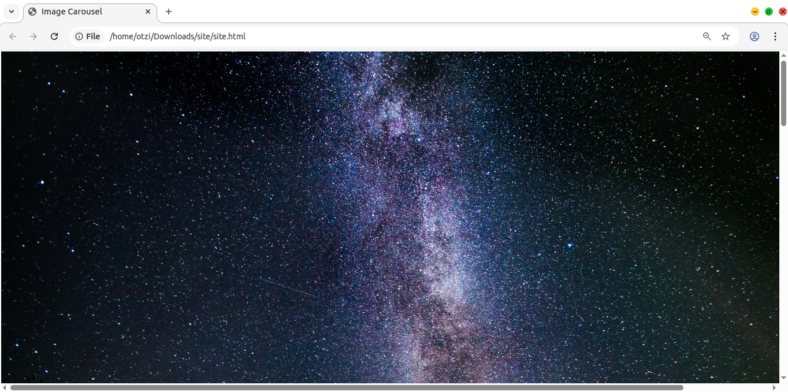
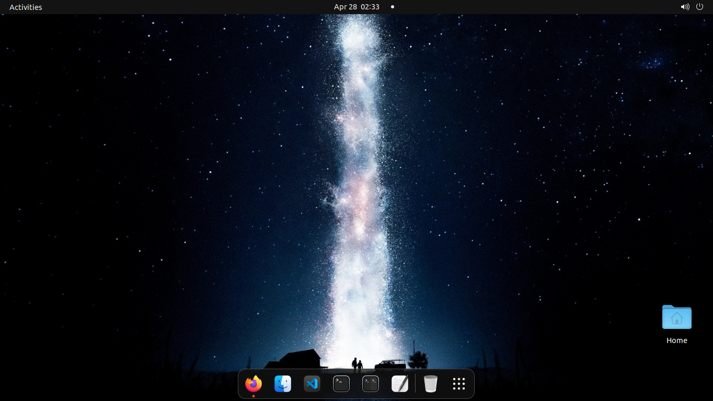
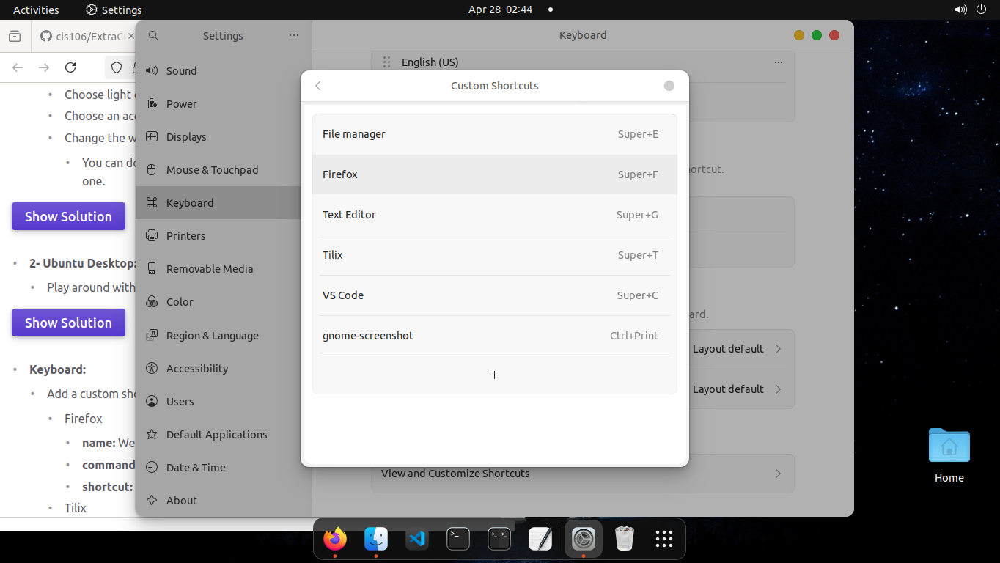
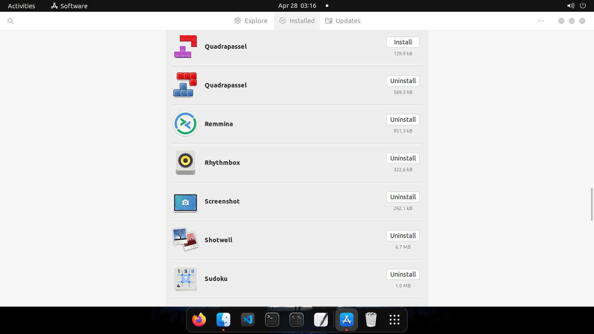
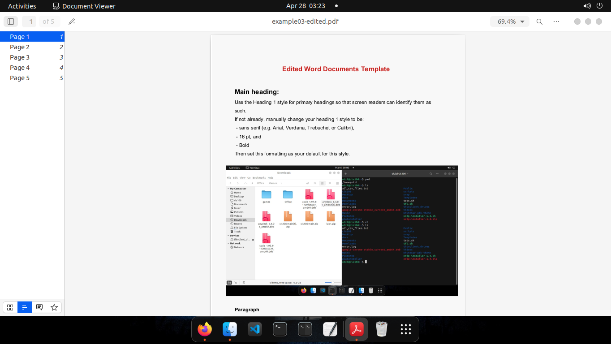
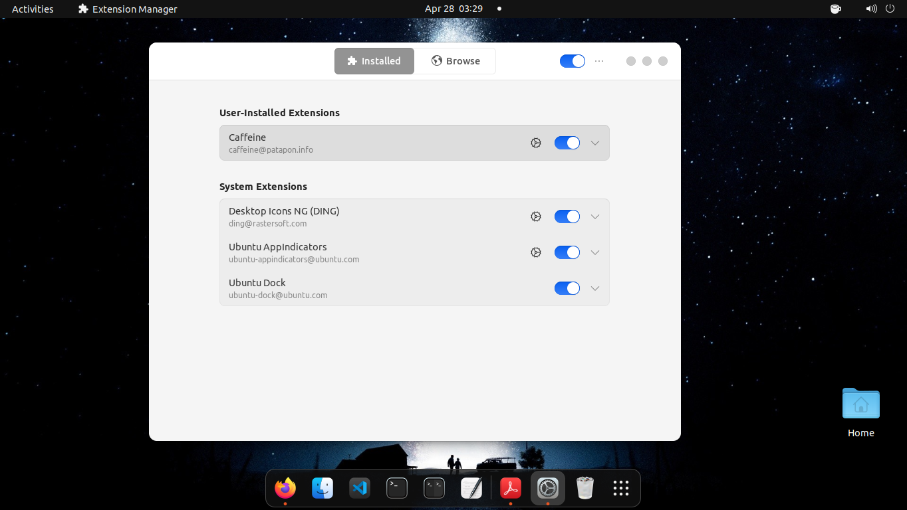

# Extra Credit 1: Getting used to the Gnome Desktop Environment

## Practice 1.1

## Practice 1.2 Part 1

## Practice 1.2 Part 2

## Practice 2.1

## Practice 2.2

## Practice 3

## Practice 4

## Practice 5
