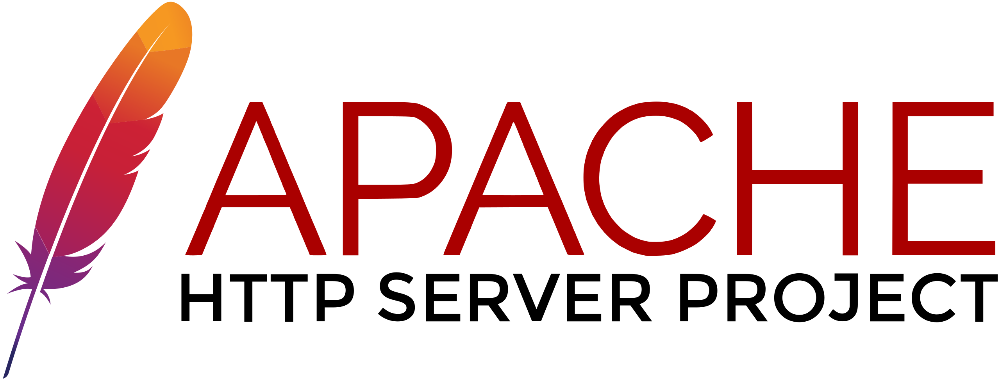
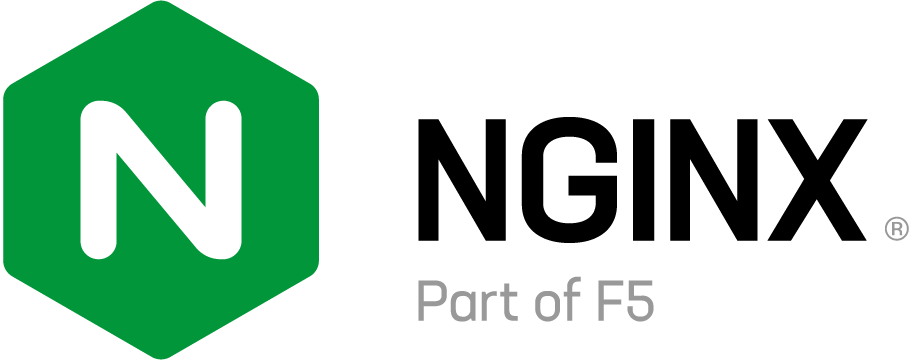
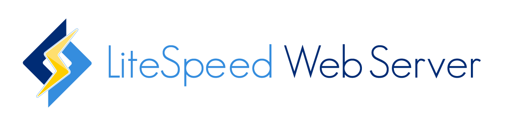
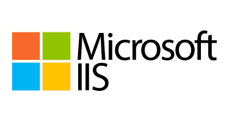

# Deliverable 1 Submission

## Basic Terminology

### What is a web server?

A web server is both **hardware** and **software** that uses HTTP (Hypertext Transfer Protocol) and other protocols to respond to client requests made over the World Wide Web.  
- On the **hardware** side, it is a computer that stores web server software and a website’s component files.
- On the **software** side, it includes the server operating system and web server software such as Apache, Nginx, or IIS, which handles requests and delivers web content.

### What are some different web server applications?

| Logo | Application Name | License                          | Project's Website                    |
|------|------------------|----------------------------------|--------------------------------------|
|  | Apache HTTP      | Apache License 2.0               | [httpd.apache.org](https://httpd.apache.org) |
|   | Nginx            | BSD-like license                 | [nginx.org](https://nginx.org)       |
|  | LiteSpeed        | Proprietary/Free for OpenLiteSpeed | [litespeedtech.com](https://www.litespeedtech.com) |
|  | Microsoft IIS    | Proprietary (Microsoft)          | [docs.microsoft.com](https://docs.microsoft.com/en-us/iis/) |
|  | Caddy            | Apache License 2.0               | [caddyserver.com](https://caddyserver.com) |

### What is virtualization?

Virtualization is a technology that allows you to create multiple simulated environments or dedicated resources from a single physical hardware system. This allows for more efficient use of physical hardware and isolation between different operating systems.

### What is VirtualBox?

VirtualBox is a free and open-source hosted hypervisor developed by Oracle. It enables users to run multiple operating systems on a single physical machine using virtual machines.

### What is a virtual machine?

A virtual machine (VM) is a software emulation of a physical computer. It runs an operating system and applications just like a physical machine, but it is managed by a hypervisor on the host machine.

   
### What is Ubuntu Server?

Ubuntu Server is a server operating system, developed by Canonical, based on Debian Linux. It is designed for server use and lacks a graphical user interface by default, providing a lightweight and efficient platform for web hosting, file serving, and other server roles.

#### Example Ubuntu Server Logo

### What is a firewall?

A firewall is a network security device or software that monitors and controls incoming and outgoing network traffic based on predetermined security rules. It establishes a barrier between a trusted internal network and untrusted external networks.

### What is SSH?

SSH, or Secure Shell, is a cryptographic network protocol used to securely connect to remote systems over an unsecured network. It provides strong authentication and encrypted data communications between two computers.

## Other Relevant Concepts

* **Systemd**: A system and service manager for Linux operating systems. It is the default init system for many distributions.
* **Systemctl**: The command-line tool used to interact with systemd services (start, stop, enable, etc.).
* **Virtual hosts**: Virtual hosts allow a single web server to host multiple domains or websites.
* **Log file**: A file that records events and messages related to system or software operations.