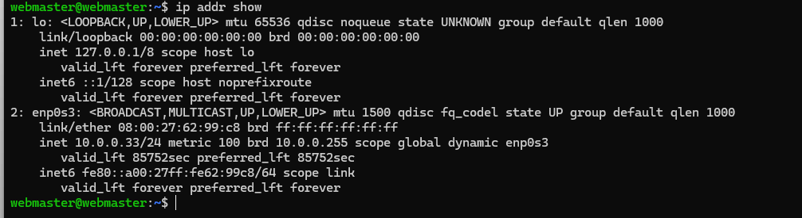

# Deliverable 2 Submission

## Server Specifications


## Ubuntu Login Screen


<br><br><br><br><br><br><br><br>
## Questions

### 3. What is the IP address of your Ubuntu Server Virtual Machine?

You can use the command:
```bash
ip
```

**Definition:** `ip` is a utility to show and manipulate routing, devices, policy routing, and tunnels.  
**Syntax:** `ip [options] object [command]`  
**Examples:**
```bash
ip a
```

#### Screenshot


```bash
ip addr show
```

#### Screenshot

---

<br><br><br><br><br>

### 4. How do you enable the Ubuntu Firewall?

```bash
sudo ufw enable
```

#### Screenshot


**Definition:** `ufw` stands for Uncomplicated Firewall, a frontend for `iptables`.  
**Syntax:** `ufw [command] [rule]`  
**Examples:**
```bash
sudo ufw enable
```

#### Screenshot


```bash
sudo ufw allow ssh
```

#### Screenshot

---

<br><br><br><br><br><br>

### 5. How do you check if the Ubuntu Firewall is running?
```bash
sudo ufw status
```

#### Screenshot


---

### 6. How do you disable the Ubuntu Firewall?
```bash
sudo ufw disable
```

#### Screenshot


---

### 7. How do you add Apache to the Firewall?
```bash
sudo ufw allow 'Apache'
```

#### Screenshot


---

<br><br><br>

### 8. What is the command you used to install Apache?
```bash
sudo apt install apache2
```

#### Screenshot


---

### 9. What is the command you use to check if Apache is running?
```bash
sudo systemctl status apache2
```

#### Screenshot


---

### 10. What is the command you use to stop Apache?
```bash
sudo systemctl stop apache2
```

#### Screenshot


<br><br>

### 11. What is the command you use to restart Apache?
```bash
sudo systemctl restart apache2
```

#### Screenshot


---

### 12. What is the command used to test Apache configuration?
```bash
sudo apache2ctl configtest
```

#### Screenshot


---

### 13. What is the command used to check the installed version of Apache?
```bash
apache2 -v
```

#### Screenshot


---
<br><br><br><br><br><br><br><br><br>

## 14. What are the most common commands to troubleshoot Apache errors?

- `journalctl -xe`: Shows systemd logs, including Apache errors
- `tail /var/log/apache2/error.log`: Shows the most recent Apache error messages
- `systemctl status apache2`: Displays current Apache status and recent log entries

### Examples:
```bash
sudo journalctl -xe
sudo tail /var/log/apache2/error.log
sudo systemctl status apache2
```


---

## 15. Which are Apache Log Files, and what are they used for?

| File | Description |
|------|-------------|
| `/var/log/apache2/access.log` | Contains all requests processed by Apache |
| `/var/log/apache2/error.log`  | Contains all Apache errors |

### Example commands:
```bash
sudo head /var/log/apache2/access.log
```

#### Screenshot


```bash
sudo tail /var/log/apache2/error.log
```

#### Screenshots
